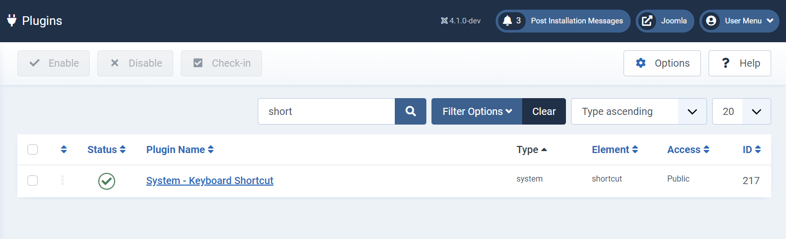
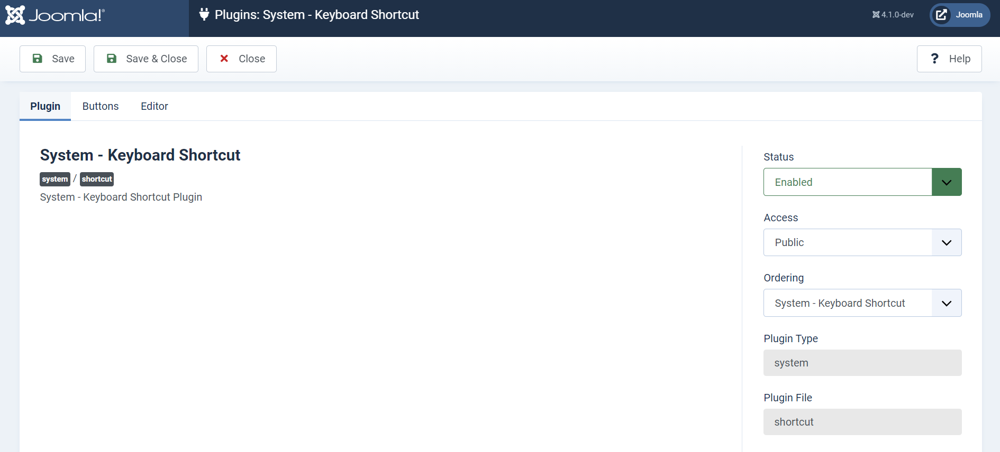
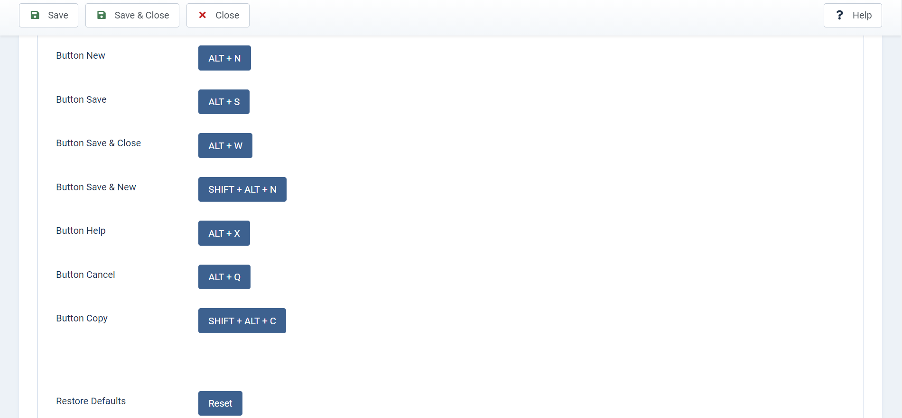

## Google SoC 2021 Accessibility Work Report
The purpose of creating this repository is to maintain a report summary of my GSoC work and this may also serve as a guide for future GSoC aspirants and a reference to the developers and contributors to the project.

**Project Proposal :** [Final Proposal](https://storage.googleapis.com/summerofcode-prod.appspot.com/gsoc/core_project/doc/5255878900449280_1618326918_Joomla_Proposal.pdf?Expires=1629522222&GoogleAccessId=summerofcode-prod%40appspot.gserviceaccount.com&Signature=HaQ5AZOfKhaNnJ4Ri20n7rmXn6rDT2jprxlk15JFVgiWnsMfkPQVcR2l6%2B1VZZAXCt2FiowHbZRMMwit7fiTirCSLK%2BIuo7w7D%2FTeRAcXGYdqmBA9yjBoKc7fAIWaXxUSB4%2Bhv0JymCGVDTE5EuYjEb4Ss6sm4FG0zZiANzfKWR5Pk%2BjEbgqn1CzyGz5v%2FGHPUDTrHZFwLrFEB4VZA3D8TiD04OfjNyWo9s8adXlaDcGulhTNq2CFMCXxTVQeGwFUiZLXgx6%2FMNE%2B8IDM4bDzqkIeobz4LhIwAllv90k6ncxF7s4s8cKlp9B2wOkYGVL%2F3PWIPNry5TMiJOx5AFxpw%3D%3D)

**Project Overview :**  [Accessibility](https://summerofcode.withgoogle.com/projects/#4744517745377280)

**Project Repository :** [Repository](https://github.com/joomla-projects/gsoc21_accessibility)

**Weekly Reports :** [Reports](https://volunteers.joomla.org/teams/gsoc-2021-accessibility#reports)

**Blog Post :** [Coding Phase-1](https://community.joomla.org/gsoc-2021/gsoc-project-accessibility.html)

### Overview
Implement and improve several accessibility functions in Joomla! Keyboard navigation. Web accessibility means designing and developing your website so that people with disabilities can perceive, understand, navigate, and interact with, and contribute to the Web.
 

#### Keyboard Shortcut Plugin
Here you can find the Plugin. [ Joomla --> System --> Plugins --> Shortcut]

#### System Plugin Overview

#### Keyboard Shortcuts - Buttons
Here you can check and update the Buttons Key combination which is used as Shortcut to navigate through Keyboard

**Reset Buttons is used to Restore the Defaults Key combination shortcut**

